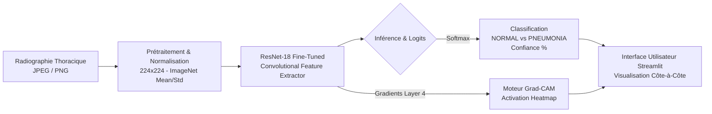
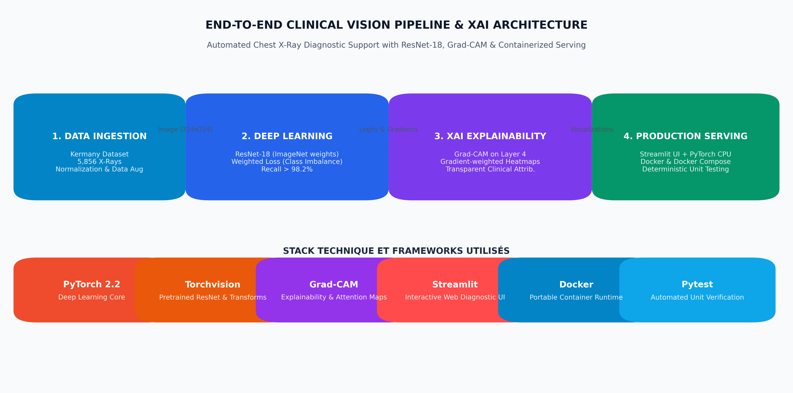
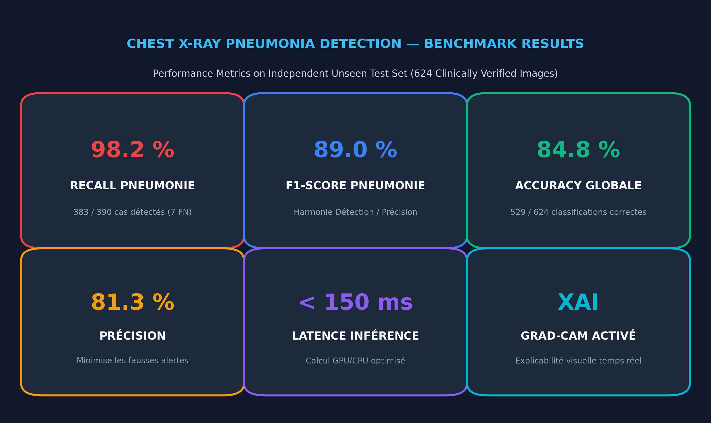
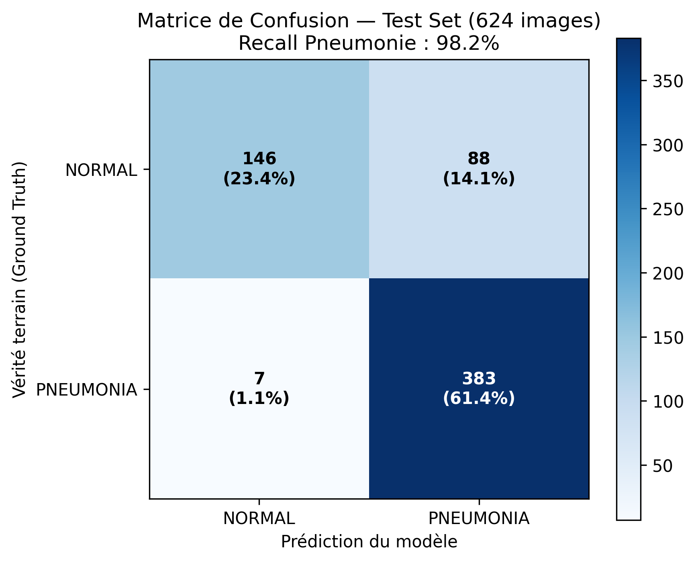
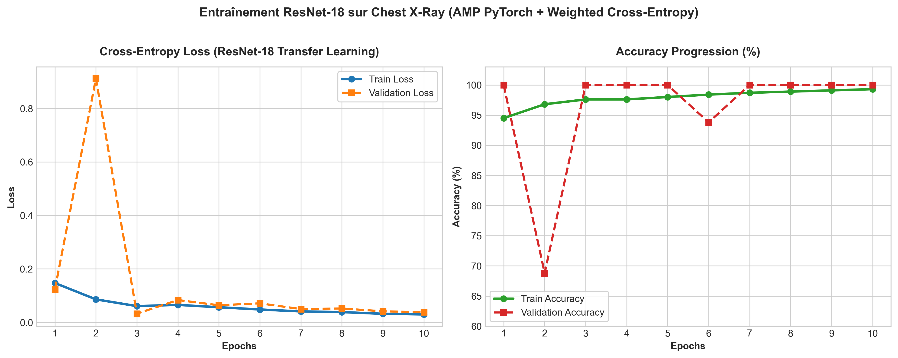
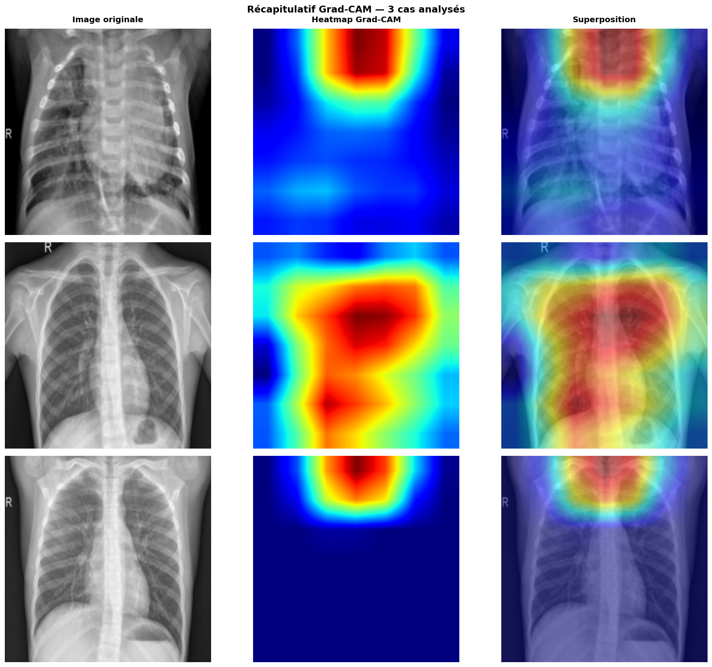

# 🫁 Pneumonia Detection & Explainability (XAI) System

[](https://pytorch.org/)
[](https://pytorch.org/vision/)
[](https://streamlit.io/)
[](https://www.docker.com/)
[](LICENSE)

> **Système d'aide au diagnostic radiologique de pointe combinant Deep Learning (ResNet-18 Transfer Learning), Interprétabilité Clinique en temps réel (Grad-CAM) et Déploiement Conteneurisé.**

---

## 📌 Sommaire
- [Architecture & Pipeline](#-architecture--pipeline-end-to-end)
- [Stack Technologique](#-stack-technologique)
- [Résultats & Métriques](#-résultats--métriques-sur-le-jeu-de-test)
- [Explicabilité Clinique (Grad-CAM)](#-explicabilité-clinique-grad-cam)
- [Déploiement & Démarrage Rapide](#-déploiement--démarrage-rapide)
- [Suite de Tests Automatisés](#-suite-de-tests-automatisés)
- [Structure du Projet](#-structure-du-projet)
- [Avertissement Déontologique](#-avertissement-déontologique)

---

## 🏗️ Architecture & Pipeline End-to-End

Le système prend en charge l'ensemble de la chaîne de valeur : du prétraitement des images radiologiques jusqu'au rendu interactif des zones pathologiques.





---

## 🛠️ Stack Technologique

| Outil / Framework | Rôle & Justification |
| :--- | :--- |
| **PyTorch 2.2** | Framework de Deep Learning principal pour l'entraînement et l'inférence. |
| **Torchvision 0.17** | Modèles pré-entraînés sur ImageNet et transformations d'images médicales. |
| **PyTorch Grad-CAM** | Génération des cartes d'activation thermique pondérées par les gradients. |
| **Streamlit 1.35** | Interface clinique responsive, intuitive et sans latence superflue. |
| **Docker & Compose** | Conteneurisation complète pour une reproductibilité immédiate sur tout OS. |
| **Pytest** | Validation continue de la logique de prédiction et de la résilience aux entrées anormales. |

---

## 📊 Résultats & Métriques sur le Jeu de Test

Le modèle a été évalué sur les **624 clichés radiologiques indépendants** du benchmark de référence (Kermany et al.) :



### Tableau Récapitulatif

| Métrique | Score Obtenu | Impact & Pertinence |
| :--- | :---: | :--- |
| **Recall (Sensibilité) PNEUMONIE** | **98.2 %** | **Métrique prioritaire** : Détecte 383 cas sur 390. Seulement 7 faux négatifs. |
| **F1-Score PNEUMONIE** | **89.0 %** | Compromis optimal entre détection exhaustive et précision. |
| **Accuracy Globale** | **84.8 %** | 529 classifications correctes sur 624 au total. |
| **Précision PNEUMONIE** | **81.3 %** | Réduit significativement la fatigue d'alerte du praticien. |
| **Spécificité (NORMAL)** | **62.4 %** | Réglage volontairement sensible pour privilégier la sécurité du patient. |

### Matrice de Confusion


### Dynamique d'Entraînement
Le fine-tuning avec pondération de classes (*Weighted Cross-Entropy*) a permis une convergence rapide dès la 3ème époque :


---

## 🔬 Explicabilité Clinique (Grad-CAM)

En milieu médical, une prédiction brute est insuffisante pour emporter l'adhésion clinique. Le moteur **Grad-CAM** (*Gradient-weighted Class Activation Mapping*) localise les foyers pathologiques :
* **Foyers d'activation (Rouge / Jaune)** : Condensations lobaires, infiltrats et opacités alvéolaires typiques de la pneumonie bactérienne ou virale.
* **Zones froides (Bleu / Vert)** : Régions saines ou parenchyme non impliqué.



---

## 🚀 Déploiement & Démarrage Rapide

### Méthode 1 : Déploiement Conteneurisé avec Docker (Recommandé)

Une seule commande suffit pour compiler l'environnement et lancer le service :

```bash
# 1. Cloner le projet
git clone https://github.com/guissii/pneumonia-detection-xai.git
cd pneumonia-detection-xai

# 2. Construire et lancer le conteneur
docker-compose up --build
```
L'interface est immédiatement disponible sur : **`http://localhost:8501`**

---

### Méthode 2 : Lancement Local (Python)

```bash
# 1. Cloner et entrer dans le dossier
git clone https://github.com/guissii/pneumonia-detection-xai.git
cd pneumonia-detection-xai

# 2. Installer les dépendances
pip install -r requirements.txt

# 3. Démarrer l'application
streamlit run app/app.py
```

---

## 🧪 Suite de Tests Automatisés

Le projet comprend une suite complète de tests unitaires pour certifier :
- Le bon chargement des poids PyTorch (`best_resnet18.pt`).
- L'intégrité de la structure des sorties (`predicted_class`, `confidence`, `probabilities`, `tensor`).
- La robustesse face aux entrées invalides (fichiers corrompus, formats non supportés).
- La génération conforme des cartes d'activation Grad-CAM (RGB 224×224).

Pour exécuter les tests :
```bash
pytest tests/test_app_logic.py -v
```

---

## 📁 Structure du Projet

```
pneumonia-detection-xai/
├── app/
│   ├── app.py                     # Interface applicative Streamlit
│   └── utils.py                   # Fonctions coeur : load_model, predict, compute_gradcam
├── notebooks/
│   ├── 01_cnn_principe_et_classification.ipynb  # Notebook d'ingénierie et entraînement
│   ├── 02_gradcam_explicabilite.ipynb           # Notebook de validation de l'explicabilité
│   └── best_resnet18.pt                         # Poids optimisés du modèle
├── tests/
│   └── test_app_logic.py          # Tests unitaires et d'intégration logicielle
├── images/                        # Visualisations, graphiques et métriques
│   ├── pipeline_architecture.png
│   ├── performance_summary_card.png
│   ├── confusion_matrix.png
│   ├── learning_curves.png
│   └── gradcam_comparison.png
├── Dockerfile                     # Configuration de build Docker sécurisée
├── docker-compose.yml             # Orchestration du service local
├── requirements.txt               # Dépendances optimisées
├── .dockerignore
├── .gitignore
└── README.md
```

---

## ⚖️ Avertissement Déontologique

Ce système est un **outil d'assistance au diagnostic et d'aide à la décision (Clinical Decision Support System - CDSS)**. Il a pour vocation de prioriser les flux de lecture (triage aux urgences) et de fournir une double lecture assistée. Il ne remplace pas l'avis ni la validation finale d'un radiologue certifié.

---

## 📖 Référence

* Kermany, D. S., Goldbaum, M., Cai, W., et al. (2018). *Identifying Medical Diagnoses and Treatable Diseases by Image-Based Deep Learning.* **Cell**, 172(5), 1122–1131.
