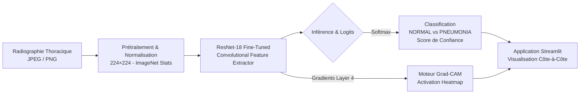
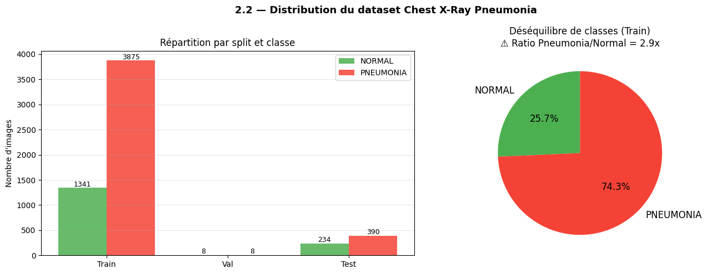
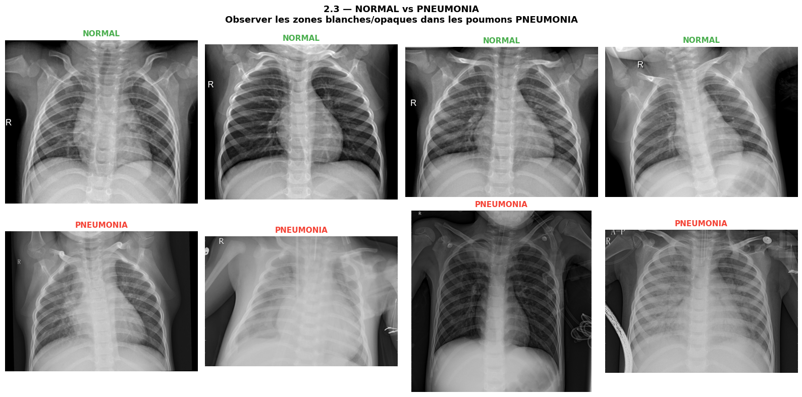
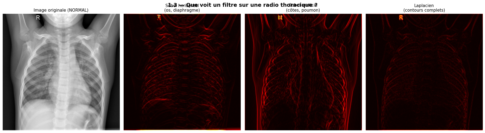
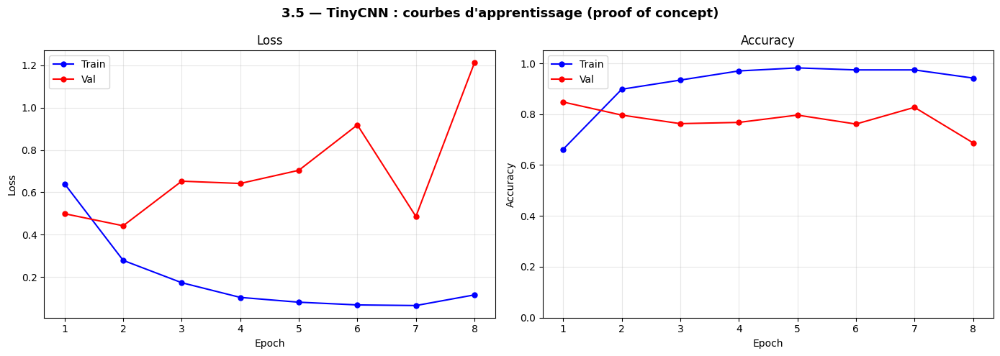
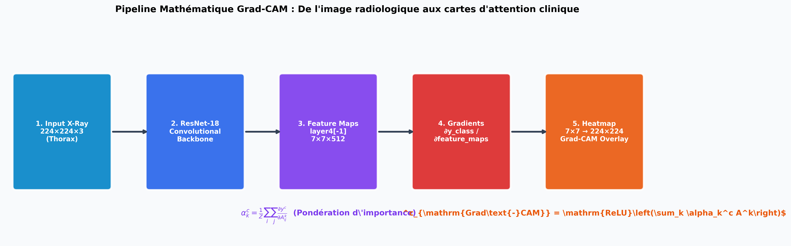

# 🫁 Pneumonia Detection & Explainability (XAI) System
### Deep Learning, Clinical Explainability (Grad-CAM) & Containerized Serving

[](https://pytorch.org/)
[](https://pytorch.org/vision/)
[](https://streamlit.io/)
[](https://www.docker.com/)
[](https://pytest.org/)
[](LICENSE)

---

## 📌 Sommaire
- [1. Vue d'Ensemble & Architecture Système](#1-vue-densemble--architecture-système)
- [2. Exploration & Analyse du Dataset Médical](#2-exploration--analyse-du-dataset-médical)
- [3. Ingénierie Deep Learning : Du Baseline au Transfer Learning](#3-ingénierie-deep-learning--du-baseline-au-transfer-learning)
- [4. Résultats & Évaluation Clinique](#4-résultats--évaluation-clinique)
- [5. Explicabilité Clinique : Moteur Grad-CAM (XAI)](#5-explicabilité-clinique--moteur-grad-cam-xai)
- [6. Déploiement & Démarrage Rapide (Docker / Local)](#6-déploiement--démarrage-rapide)
- [7. Tests & Intégration Logicielle](#7-tests--intégration-logicielle)
- [8. Structure du Répertoire](#8-structure-du-répertoire)

---

## 1. Vue d'Ensemble & Architecture Système

Ce système fournit un flux d'aide à la décision diagnostique end-to-end : de la radiographie brute jusqu'à la localisation des foyers d'infection pulmonaire via des cartes thermiques d'attention.



### Architecture Complète du Pipeline


---

## 2. Exploration & Analyse du Dataset Médical

Le projet s'appuie sur le benchmark international de **Kermany et al. (2018)** composé de 5 856 radiographies thoraciques pédiatriques.

### 2.1 Distribution et Déséquilibre des Classes
L'analyse initiale a révélé un déséquilibre marqué (~74% de clichés pathologiques dans le train set), imposant une stratégie de **pondération des classes (*Weighted Cross-Entropy*)** pour éviter de biaiser le modèle.



### 2.2 Observation Visuelle des Clichés
Différenciation nette entre un parenchyme pulmonaire sain (radiotransparent, noir) et des poumons atteints de pneumonie présentant des opacités, consolidations lobaires ou infiltrats diffus.



---

## 3. Ingénierie Deep Learning : Du Baseline au Transfer Learning

### 3.1 Extraction de Caractéristiques par Convolution
Chaque couche convolutionnelle extrait des représentations hiérarchiques (bords anatomiques, contours des côtes, textures des tissus alvéolaires).



### 3.2 Modèle Baseline : TinyCNN (From Scratch)
Un CNN léger entraîné à partir de zéro a servi de point de repère initial pour mesurer l'apport du pré-entraînement :
- **Architecture** : 3 blocs Conv2D + BatchNorm + ReLU + MaxPool.
- **Résultat** : Limitation rapide due au manque de données d'initialisation génériques.



### 3.3 Modèle de Production : ResNet-18 (Transfer Learning)
- **Backbone** : ResNet-18 pré-entraîné sur ImageNet (11,17 millions de paramètres).
- **Couche finale adaptée** : Remplacement du classifieur par un bloc linéaire à 2 sorties (`NORMAL`, `PNEUMONIA`).
- **Optimisation** : Mixed Precision Training (`torch.cuda.amp`), AdamW ($lr=1e-4$), pondération de perte inversement proportionnelle aux fréquences de classe.
- **Convergence** : Stabilisation rapide avec une loss de validation optimale dès la 3ème époque.


---

## 4. Résultats & Évaluation Clinique

Évalué sur le **jeu de test indépendant de 624 radiographies** jamais vues pendant l'entraînement :


### Tableau Détaillé des Métriques

| Métrique | Valeur | Impact Médical & Décisionnel |
| :--- | :---: | :--- |
| **Recall (Sensibilité) PNEUMONIE** | **98.2 %** | **Métrique critique** : 383 détections sur 390 cas. Seulement 7 faux négatifs. |
| **F1-Score PNEUMONIE** | **89.0 %** | Équilibre remarquable entre sensibilité et précision. |
| **Accuracy Globale** | **84.8 %** | 529 classifications correctes sur 624 clichés testés. |
| **Précision PNEUMONIE** | **81.3 %** | Réduit significativement le risque de fausses alertes. |
| **Spécificité (NORMAL)** | **62.4 %** | Réglage conservateur privilégiant systématiquement la sécurité du patient. |

### Matrice de Confusion


> **Interprétation clinique** : Sur 390 patients réellement atteints de pneumonie, **383 sont correctement détectés**. Dans un contexte de triage aux urgences, ce modèle garantit que la quasi-totalité des urgences respiratoires sont immédiatement signalées au praticien.

---

## 5. Explicabilité Clinique : Moteur Grad-CAM (XAI)

Les réseaux de neurones sont traditionnellement des « boîtes noires ». En imagerie médicale, un pourcentage seul ne permet pas d'établir la confiance.

### 5.1 Formulation Mathématique du Pipeline Grad-CAM
Grad-CAM calcule les gradients du score de classe cible $y^c$ par rapport aux cartes d'activation $A^k$ de la dernière couche de convolution (`layer4[-1]`) :

$$\alpha_k^c = \frac{1}{Z}\sum_{i}\sum_{j}\frac{\partial y^c}{\partial A_{ij}^k}$$

$$L^c_{\mathrm{Grad\text{-}CAM}} = \mathrm{ReLU}\left(\sum_k \alpha_k^c A^k\right)$$



### 5.2 Étude de Cas Cliniques Comparatifs
La superposition de la carte de chaleur permet au praticien de valider visuellement si l'attention du modèle correspond bien aux zones de condensation alvéolaire ou d'infiltrat interstitiel :


---

## 6. Déploiement & Démarrage Rapide

### Option A — Conteneur Docker (Recommandé, reproductibilité garantie)

```bash
# 1. Cloner le projet
git clone https://github.com/guissii/pneumonia-detection-xai.git
cd pneumonia-detection-xai

# 2. Lancer via Docker Compose
docker-compose up --build
```
L'application est immédiatement accessible sur **`http://localhost:8501`**.

---

### Option B — Environnement Local Python

```bash
# 1. Cloner le projet
git clone https://github.com/guissii/pneumonia-detection-xai.git
cd pneumonia-detection-xai

# 2. Installer les dépendances
pip install -r requirements.txt

# 3. Démarrer l'interface Streamlit
streamlit run app/app.py
```

---

## 7. Tests & Intégration Logicielle

Le système intègre une suite de tests unitaires indépendante de l'interface graphique :
- Intégrité du chargement du modèle PyTorch (`load_model`).
- Conformité du schéma de sortie de la fonction `predict()`.
- Gestion des erreurs et robustesse aux images corrompues.
- Génération et dimensionnement des heatmaps Grad-CAM.

```bash
pytest tests/test_app_logic.py -v
```

---

## 8. Structure du Répertoire

```
pneumonia-detection-xai/
├── app/
│   ├── app.py                       # Interface utilisateur Streamlit
│   └── utils.py                     # Modules de chargement, inférence et Grad-CAM
├── notebooks/
│   ├── 01_cnn_principe_et_classification.ipynb  # Ingénierie des données & entraînement
│   ├── 02_gradcam_explicabilite.ipynb           # Recherche et validation de l'explicabilité
│   └── best_resnet18.pt                         # Poids entraînés du modèle
├── tests/
│   └── test_app_logic.py            # Suite de validation logicielle
├── images/                          # Visualisations et illustrations techniques
│   ├── pipeline_architecture.png
│   ├── performance_summary_card.png
│   ├── dataset_class_distribution.png
│   ├── dataset_sample_cases.png
│   ├── feature_maps_convolution.png
│   ├── cnn_architecture_overview.png
│   ├── tiny_cnn_baseline_curves.png
│   ├── learning_curves.png
│   ├── confusion_matrix.png
│   ├── gradcam_mathematical_pipeline.png
│   └── gradcam_comparison.png
├── Dockerfile                       # Image Docker optimisée
├── docker-compose.yml               # Service Streamlit isolé
├── requirements.txt                 # Dépendances de production
├── .dockerignore
├── .gitignore
└── README.md
```

---

## ⚖️ Avertissement Déontologique

Ce système est un **système d'aide à la décision clinique (CDSS)** conçu pour le triage et la priorisation des flux radiologiques. Il ne constitue pas un dispositif médical autonome et chaque analyse doit être validée par un radiologue qualifié.

---

## 📖 Référence Académique

* Kermany, D. S., Goldbaum, M., Cai, W., et al. (2018). *Identifying Medical Diagnoses and Treatable Diseases by Image-Based Deep Learning.* **Cell**, 172(5), 1122–1131.
